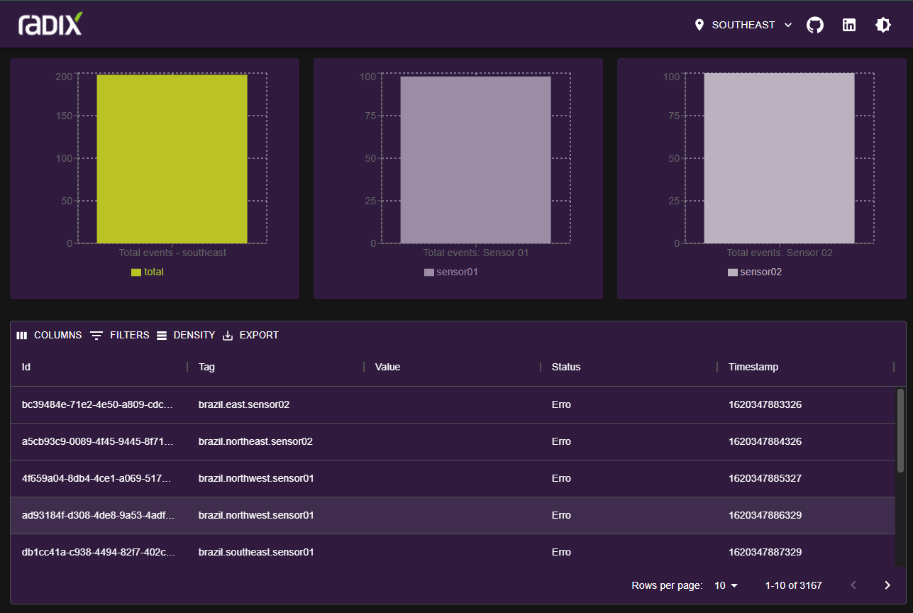
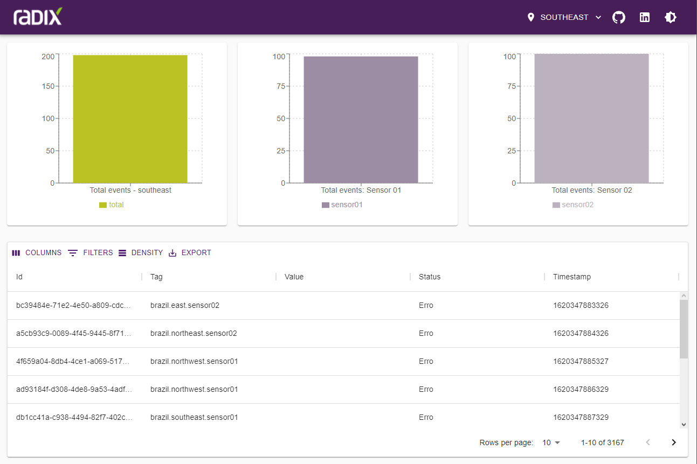

<div align="center" id="top"> 
  

  &#xa0;
</div>

<h1 align="center">Sensor Reporter</h1>

<p align="center">
  <a href="#dart-sobre">Sobre</a> &#xa0; | &#xa0; 
  <a href="#sparkles-funcionalidades">Funcionalidades</a> &#xa0; | &#xa0;
  <a href="#rocket-tecnologias">Tecnologias</a> &#xa0; | &#xa0;
  <a href="#white_check_mark-pré-requesitos">Pré requisitos</a> &#xa0; | &#xa0;
  <a href="#checkered_flag-começando">Começando</a> &#xa0; | &#xa0;
  <a href="#bar_chart-gráficos">Gráficos</a> &#xa0; | &#xa0;
  <a href="#memo-licença">Licença</a> &#xa0; | &#xa0;
  <a href="https://github.com/leduardo99" target="_blank">Autor</a>
</p>

<br>

## :dart: Sobre ##

`Sensor Reporter` é uma aplicação que tem como objetivo mostrar para o usuário final de forma clara 
os eventos gerados por sensores espalhados pelo brasil.

A aplicação captura os eventos emitido pelos sensores (`emulador`) e envia para o frontend por meio de websocket
o evento que foi capturado.

&#xa0;

<div align="center" id="top"> 
  

  
  &#xa0;
</div>

## :sparkles: Funcionalidades ##

:heavy_check_mark: Comuniação em tempo real;\
:heavy_check_mark: Serviço de mensageria;\
:heavy_check_mark: Docker;

## :rocket: Tecnologias ##

As seguintes ferramentas foram usadas na construção do projeto:

- [Node.js](https://nodejs.org/en/)
- [React](https://pt-br.reactjs.org/)
- [Next.js](https://nextjs.org/docs/getting-started)
- [TypeScript](https://www.typescriptlang.org/)
- [.NET Core](https://docs.microsoft.com/pt-br/dotnet/core/introduction)
- [Docker](https://www.docker.com)
- [Apache Kafka](https://kafka.apache.org)

## :white_check_mark: Pré requisitos ##

Antes de começar :checkered_flag:, você precisa ter o [Git](https://git-scm.com) e o [Node](https://nodejs.org/en/) instalados em sua maquina.

## :checkered_flag: Começando ##

_Todas as variáveis de ambientes já estão configuradas no docker-compose._

```bash
# Clone este repositório
$ git clone https://gitlab.com/leduardo99/junior-analyst.git sensor-reporter

# Entre na pasta
$ cd sensor-reporter

# Suba os serviços
$ docker-compose -f "docker-compose.yml" up -d --build

# Frontend -> <http://localhost:3000>
# PGAdmin -> <http://localhost:15432>
# API -> <http://localhost:5000>
```

## :bar_chart: Gráficos ##
A aplicação possui 3 gráficos
 - Total de ventos por região
 - Total de eventos do sensor 01
 - Total de ventos do sensor 02

Na região superior há um filtro de regiões, esse filtro dará a possibilidade de visualizar a quantidade eventos das outras regiões e sensores.

## :memo: Licença ##

Este projeto está sob licença MIT. Veja o arquivo [LICENSE](LICENSE.md) para mais detalhes.


Feito com :heart: por <a href="https://github.com/leduardo99" target="_blank">Luis Eduardo</a>

&#xa0;

<a href="#top">Voltar para o topo</a>
